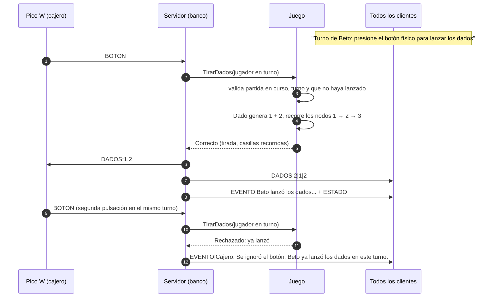
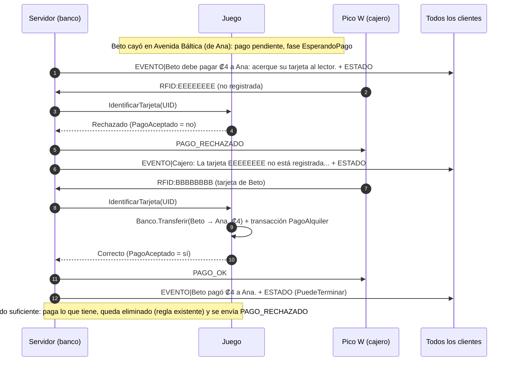

# Protocolo cliente-servidor

Comunicación por **sockets TCP** entre los clientes (jugadores) y el servidor (el **banco**, que corre en la computadora del organizador). Implementación: `Monopoly.Core.Red` (`Protocolo`, `Servidor`, `Cliente`, `SerializadorEstado`, `SerializadorTransacciones`).

## 1. Formato

- Puerto predeterminado: **5000** (configurable). El servidor escucha en todas las interfaces (`IPAddress.Any`).
- **Un mensaje por línea**, texto **UTF-8** sin BOM, terminado en `\n` (se acepta `\r\n` al leer).
- Formato: `COMANDO|campo1|campo2|...`. El comando va en mayúsculas (el servidor también acepta minúsculas).
- **Escape** dentro de los campos:

  | Carácter | Se envía como |
  |---|---|
  | `\` | `\\` |
  | `\|` (separador) | `\\|` |
  | salto de línea `\n` | `\n` (barra + letra n) |
  | retorno `\r` | `\r` (barra + letra r) |

  Ejemplo: el texto `Paga 50 | cumpleaños` viaja como `EVENTO|Paga 50 \| cumpleaños` (la barra invertida delante del separador indica que es parte del texto).
- Números en formato invariante (sin separador de miles). Booleanos como `1`/`0`. Un campo opcional vacío significa "ninguno".

## 2. Principios

- El cliente **solo envía solicitudes**. Nunca envía saldos, posiciones, dados, turnos, propiedades ni transacciones.
- El servidor **identifica al jugador por su conexión** (asociada en `CONECTAR`), no por un id enviado por el cliente.
- Toda solicitud la valida `Juego`. Si se rechaza, solo el solicitante recibe `ERROR|motivo`.
- Tras cada acción aceptada, el servidor **difunde a todos** los jugadores: los `EVENTO` nuevos, el `ESTADO` completo y, si la partida terminó, `FIN`. Tras una tirada (botón físico o `TIRAR_DADOS` en modo sin hardware) además envía `DADOS` antes de los eventos.
- Las solicitudes se procesan de a una, así que todos reciben los mensajes en el mismo orden.

## 3. Solicitudes del cliente (cliente → servidor)

| Mensaje | Campos | Si se acepta | Errores posibles |
|---|---|---|---|
| `CONECTAR\|nombre[\|forma\|color]` | nombre del jugador y, opcionalmente, la ficha elegida: forma (`Sombrero`, `Carro`, `Barco`, `Perro`, `Dedal`, `Bota`) y color (`Rojo`, `Azul`, `Verde`, `Amarillo`, `Morado`, `Naranja`); si se omiten, el servidor asigna la primera libre | `BIENVENIDA` al solicitante; `EVENTO` + `ESTADO` a todos | partida ya iniciada, máximo 4 jugadores, nombre vacío/repetido/reservado (`BANCO`), forma o color ya elegidos por otro (`La ficha Perro ya la eligió Ana; elija otra.`), valor de ficha desconocido (`Ficha no válida: ...`), jugador ya conectado, conexión ya asociada. Al reconectarse, la ficha enviada se ignora |
| `INICIAR_PARTIDA` | — | `EVENTO` + `ESTADO` a todos | no es el organizador (primer jugador), menos de 2 jugadores, ya iniciada; en **modo hardware**, algún jugador sin tarjeta vinculada (`Todos los jugadores deben tener una tarjeta vinculada antes de iniciar. Faltan: X, Y.`) |
| `TIRAR_DADOS` | — | **solo en modo sin hardware**: `DADOS` + `EVENTO` + `ESTADO` a todos | en modo hardware siempre `ERROR\|Los dados se lanzan con el botón físico del cajero.`; fuera de turno, ya lanzó en este turno, eliminado, partida no en curso |
| `COMPRAR_PROPIEDAD` | — | **no cobra**: la fase pasa a `EsperandoTarjetaCompra`; `EVENTO\|X quiere comprar P por ₡N: acerque su tarjeta al lector.` + `ESTADO` a todos. La compra se ejecuta al leer la tarjeta del comprador (sección 9) | fuera de turno, no lanzó, no es propiedad, ya tiene dueño, sin compra pendiente, ya se está esperando la tarjeta |
| `NO_COMPRAR` | — | `EVENTO` + `ESTADO` a todos; también **cancela** una compra que espera la tarjeta | fuera de turno, sin compra pendiente |
| `PAGAR_CON_TARJETA` | — | **solo en modo sin hardware**: equivale a pasar la tarjeta del solicitante (paga el pago pendiente o completa la compra); `EVENTO` + `ESTADO` a todos (y `FIN` si alguien queda como único jugador) | en modo hardware siempre `ERROR\|Acerque su tarjeta al lector del cajero.`; no hay pago ni compra pendiente, la tarjeta no es del deudor/comprador, saldo insuficiente para comprar |
| `TERMINAR_TURNO` | — | `EVENTO` + `ESTADO` a todos (y `FIN` si se llegó al máximo de turnos) | fuera de turno, no lanzó, decisión de compra pendiente, pago pendiente |
| `CONSULTAR_ESTADO` | — | `ESTADO` solo al solicitante | — |
| `CONSULTAR_TRANSACCIONES\|filtro[\|valor]` | filtro: `TODAS`, `ANTIGUAS`, `RECIENTES`, `JUGADOR\|nombre`, `TIPO\|tipo` | `TRANSACCIONES` solo al solicitante | filtro desconocido, falta el valor, tipo desconocido |
| `EXPORTAR_TRANSACCIONES` | — | se escribe `partidas/partida_AAAA-MM-DD_HH-mm-ss.txt` **en la computadora del servidor**; `EVENTO` con la ruta + `ESTADO` a todos | error de escritura |
| `DESCONECTAR` | — | el servidor cierra la conexión; `EVENTO` + `ESTADO` a los demás | — |
| `RETIRAR_JUGADOR\|idJugador` | id del jugador a retirar | `EVENTO` + `ESTADO` a todos (y `FIN` si queda uno solo) | no es el organizador, el jugador está conectado, no existe, ya fue eliminado, partida no en curso |
| `VINCULAR_TARJETA\|idJugador` | jugador al que se vinculará la próxima tarjeta leída por el cajero (`0` cancela la espera) | `EVENTO\|Cajero: Acerque al lector la tarjeta de X.` a todos; al leerla, `EVENTO` + `ESTADO` a todos (el jugador queda con tarjeta física) | no es el organizador, no hay cajero físico conectado, jugador inexistente o eliminado; al leer: la tarjeta ya está vinculada a otro jugador (`ERROR` al organizador y aviso a todos) |

Antes de `CONECTAR`, cualquier otra solicitud recibe `ERROR|Debe enviar CONECTAR|nombre antes de cualquier otra solicitud.` Un comando desconocido recibe `ERROR|Comando desconocido: X.`

**Modo hardware** (por defecto): los dados se lanzan solo con el botón físico del cajero y las compras y pagos se hacen solo con la tarjeta RFID; `TIRAR_DADOS` y `PAGAR_CON_TARJETA` se rechazan. **Modo sin hardware (pruebas)**: lo activa el organizador en su ventana; el organizador simula el botón y la tarjeta del jugador en turno (mismo flujo que la Pico), y `TIRAR_DADOS`/`PAGAR_CON_TARJETA` se aceptan (este último usa la tarjeta del solicitante, virtual `VIRTUAL-{id}` si no tiene una física). En modo sin hardware no se envía nada a la Pico.

Valores de `TIPO`: `CompraPropiedad`, `PagoAlquiler`, `PagoBanco`, `PagoEntreJugadores`, `GananciaEvento`, `PerdidaEvento`, `PremioInicio`.

## 4. Mensajes del servidor (servidor → cliente)

| Mensaje | Campos | Destino |
|---|---|---|
| `BIENVENIDA\|idJugador\|nombre` | id asignado (o recuperado al reconectarse) y nombre registrado | solicitante |
| `ERROR\|mensaje` | motivo legible del rechazo | solicitante |
| `ESTADO\|...` | estado completo (ver 4.1) | todos, o el solicitante en `CONSULTAR_ESTADO` |
| `DADOS\|idJugador\|dado1\|dado2` | quién lanzó y los dos valores (1 a 6), generados por el servidor | todos |
| `EVENTO\|texto` | una línea del registro de la partida | todos |
| `TRANSACCIONES\|filtro\|N\|...` | resultado de una consulta (ver 4.2) | solicitante |
| `FIN\|ganador\|resumen` | nombre del ganador; patrimonio de cada jugador y ruta del TXT exportado | todos |
| `SERVIDOR_CERRADO\|motivo` | el servidor se va a cerrar (por ejemplo, `El organizador cerró la partida.`); inmediatamente después cierra la conexión | todos |

### 4.1 Campos de `ESTADO`

Después de `ESTADO` vienen 21 campos fijos:

| # | Campo | Ejemplo |
|---|---|---|
| 0 | estado de la partida (`EsperandoJugadores`, `EnCurso`, `Finalizada`) | `EnCurso` |
| 1 | fase del turno (`EsperandoDados`, `EsperandoDecisionCompra`, `EsperandoTarjetaCompra`, `EsperandoPago`, `PuedeTerminar`) | `EsperandoPago` |
| 2 | número de turno | `7` |
| 3 | máximo de turnos | `100` |
| 4 | id del jugador en turno (vacío si no hay partida en curso) | `2` |
| 5 | id del ganador (vacío si no terminó) | |
| 6 | casilla de la propiedad en venta o cuya compra espera la tarjeta (vacío si no hay) | |
| 7 | id del deudor con pago pendiente (vacío si no hay) | `2` |
| 8 | monto total del pago pendiente | `4` |
| 9 | descripción del pago pendiente | `Beto debe pagar ₡4 a Ana` |
| 10 | último dado 1 (vacío si nadie lanzó) | `1` |
| 11 | último dado 2 | `2` |
| 12 | id del jugador del último movimiento | `2` |
| 13 | casillas recorridas en ese movimiento, en orden (incluye movimientos por cartas; en un envío directo a la cárcel, solo la de llegada) | `1,2,3` |
| 14 | dueños de las propiedades, `casilla:idDueño` | `3:1,39:2` |
| 15 | cantidad de eventos del registro | `31` |
| 16 | cantidad de transacciones | `5` |
| 17 | cantidad de jugadores N | `4` |
| 18 | ids de los jugadores **desconectados** (sin conexión activa con el servidor) | `2` |
| 19 | **cajero físico conectado** (Pico W en el organizador): `1`/`0` | `1` |
| 20 | **modo sin hardware (pruebas)** activo: `1`/`0`. Si vale `0` y el campo 19 también, la partida está **en pausa** esperando el cajero | `0` |

Luego **N bloques de 11 campos**, uno por jugador en orden de ingreso: `id`, `nombre`, `color` (`Rojo`, `Azul`, `Verde`, `Amarillo`, `Morado`, `Naranja`), `saldo`, `posición` (0 a 39), `activo` (1/0), `turnos por perder`, `patrimonio`, `propiedades` (casillas separadas por coma), `tarjeta física` (1/0), `forma de la ficha` (`Sombrero`, `Carro`, `Barco`, `Perro`, `Dedal`, `Bota`).

Ejemplo (2 jugadores; Beto debe alquiler a Ana):

```
ESTADO|EnCurso|EsperandoPago|2|100|2|||2|4|Beto debe pagar ₡4 a Ana|1|2|2|1,2,3|3:1|14|1|2||1|0|1|Ana|Rojo|1440|3|1|0|1500|3|1|Perro|2|Beto|Azul|1500|3|1|0|1500||1|Barco
```

### 4.2 Campos de `TRANSACCIONES`

`TRANSACCIONES|filtro|N` seguido de N bloques de 8 campos: `id`, `fecha y hora` (`yyyy-MM-ddTHH:mm:ss`), `turno`, `tipo`, `origen`, `destino`, `monto`, `descripción`. El origen o destino puede ser `BANCO`. Las transacciones vienen en el orden pedido.

```
CONSULTAR_TRANSACCIONES|JUGADOR|Ana
TRANSACCIONES|JUGADOR Ana|2|1|2026-09-29T15:30:00|1|CompraPropiedad|Ana|BANCO|60|Compra de Avenida Báltica|2|2026-09-29T15:31:10|2|PagoAlquiler|Beto|Ana|4|Avenida Báltica
```

## 5. Desconexiones y robustez

- Si un cliente se desconecta (con `DESCONECTAR` o por caída de la red), el servidor **no se cae**: cierra esa conexión, avisa a los demás con `EVENTO|X se desconectó...` (indicando si era su turno) y envía un `ESTADO` cuyo campo 18 lo marca como desconectado.
- Detección: al instante si la aplicación se cierra; en unos 20 s si se corta la red o se apaga la computadora (keepalive TCP: 10 s sin tráfico, 3 sondas cada 3 s), en ambos extremos.
- El jugador **sigue en la partida**: no se elimina, conserva saldo y propiedades, y no se salta su turno (la partida lo espera).
- Puede **reconectarse** enviando `CONECTAR` con el mismo nombre (sin distinguir mayúsculas) desde cualquier computadora: recupera su id con `BIENVENIDA`, los demás reciben `EVENTO|X se reconectó.` y todos un `ESTADO`.
- Si ese nombre ya tiene una conexión activa, se responde `ERROR|X ya está conectado desde otra conexión.`
- Si no vuelve, el organizador puede enviar `RETIRAR_JUGADOR|id`: el jugador queda eliminado sin pagar, sus propiedades se liberan y, si era su turno, pasa al siguiente. Solo lo puede pedir el organizador y solo sobre jugadores **desconectados** (errores: `Solo el organizador...`, `X está conectado...`, `No existe el jugador...`).
- Si el servidor se detiene de forma ordenada (el organizador cierra la aplicación), envía `SERVIDOR_CERRADO|motivo` a todos y cierra; el cliente informa ese motivo en su evento `Desconectado`. Si el servidor se cae sin avisar, el motivo es "Se perdió la conexión con el servidor...". El estado de la partida no se conserva entre reinicios.
- Solicitudes simultáneas: se procesan de a una (candado de procesamiento); solo prospera la del jugador en turno.
- Protección del servidor: cada envío tiene un tiempo máximo de 5 s (un cliente que deja de leer no bloquea a los demás: se le corta la conexión), las líneas recibidas tienen un máximo de 8192 caracteres y un error inesperado al procesar una solicitud responde `ERROR|Error interno...` sin cortar la conexión.
- El cliente espera como máximo 5 s para conectar (una IP inexistente no responde nunca).

## 6. Ejemplo de sesión

```
→ CONECTAR|Ana|Perro|Rojo
← BIENVENIDA|1|Ana
← EVENTO|Ana se unió a la partida con la ficha Perro (Rojo).
← ESTADO|EsperandoJugadores|EsperandoDados|0|100|...|1|1|Ana|Rojo|1500|0|1|0|1500||0|Perro
→ CONECTAR|Beto|Perro|Azul      (desde otra computadora)
← ERROR|La ficha Perro ya la eligió Ana; elija otra.
   (Beto, Carla y Dani se conectan igual)
→ INICIAR_PARTIDA
← EVENTO|La partida comenzó con 4 jugadores (máximo 100 turnos).
← EVENTO|Turno 1: le toca a Ana.
← ESTADO|EnCurso|EsperandoDados|1|100|1|...
→ TIRAR_DADOS              (desde Ana, en modo hardware)
← ERROR|Los dados se lanzan con el botón físico del cajero.
   (Ana presiona el botón físico del cajero)
← DADOS|1|1|2
← EVENTO|Ana lanzó los dados: 1 + 2 = 3.
← ESTADO|EnCurso|EsperandoDecisionCompra|1|100|1||3|...
```

## 7. Diagramas de secuencia

### 7.1 Tirada con el botón físico



### 7.2 Compra con tarjeta

```mermaid
sequenceDiagram
    autonumber
    participant A as Cliente de Ana
    participant S as Servidor (banco)
    participant J as Juego
    participant P as Pico W (cajero)
    participant C as Todos los clientes

    Note over J: Ana cayó en Avenida Báltica (EsperandoDecisionCompra)
    A->>S: COMPRAR_PROPIEDAD
    S->>J: SolicitarCompra(Ana), todavía no cobra
    J-->>S: Correcto, fase EsperandoTarjetaCompra
    S->>C: EVENTO|Ana quiere comprar Avenida Báltica por ₡60: acerque su tarjeta al lector. + ESTADO
    P->>S: RFID:BBBBBBBB (tarjeta de Beto)
    S->>J: IdentificarTarjeta(UID)
    J-->>S: Rechazado (PagoAceptado = no)
    S->>P: PAGO_RECHAZADO
    S->>C: EVENTO|Cajero: La tarjeta pertenece a Beto; se espera la tarjeta de Ana... + ESTADO
    P->>S: RFID:AAAAAAAA (tarjeta de Ana)
    S->>J: IdentificarTarjeta(UID)
    J->>J: valida comprador, propiedad libre y saldo
    J->>J: Banco.Cobrar(Ana, ₡60) + transacción CompraPropiedad
    J-->>S: Correcto (PagoAceptado = sí)
    S->>P: PAGO_OK
    S->>C: EVENTO|Ana compró Avenida Báltica por ₡60. + ESTADO (PuedeTerminar)
    Note over A,J: Sin saldo: PAGO_RECHAZADO, vuelve a EsperandoDecisionCompra y Ana puede pulsar "No comprar" (también mientras se espera la tarjeta)
```

### 7.3 Pago con tarjeta



## 8. Pruebas sin hardware

Para probar el protocolo sin la Pico W, el organizador marca **Opciones → Modo sin hardware (pruebas)**: el servidor acepta `TIRAR_DADOS` y `PAGAR_CON_TARJETA` por red, y las opciones "Simular botón" y "Simular tarjeta del jugador en turno" recorren el mismo flujo que el cajero físico. Las pruebas de integración (`tests/Monopoly.Tests/Red` y `tests/Monopoly.Tests/Hardware`) ejercitan todos los mensajes con un servidor real en loopback.

## 9. Cajero físico (Pico W)

El cajero se conecta por USB a la computadora del organizador y **no habla este protocolo**: tiene su propio protocolo serie (ver `hardware/README.md`). El servidor traduce lo que ocurre en el cajero:

- `BOTON` → tirada del **jugador en turno** con todas las validaciones (`DADOS` + `EVENTO` + `ESTADO` a todos y `DADOS:d1,d2` a la Pico). Una pulsación fuera de momento (partida no iniciada, ya lanzó, otra fase) se ignora sin errores: `EVENTO|Cajero: Se ignoró el botón: <motivo>`.
- Tarjeta leída en `EsperandoTarjetaCompra` → solo la del comprador ejecuta la compra (`PAGO_OK`); la de otro jugador, una no registrada o saldo insuficiente → `PAGO_RECHAZADO` + `EVENTO|Cajero: <motivo>`.
- Tarjeta leída en `EsperandoPago` → solo la del deudor paga (`PAGO_OK`; si el saldo no alcanza se aplica la eliminación y se envía `PAGO_RECHAZADO`); la de otro jugador o una no registrada → `PAGO_RECHAZADO` + `EVENTO|Cajero: <motivo>`.
- Tarjeta leída sin pago ni compra pendiente → `EVENTO|Cajero: Tarjeta de X: saldo ₡N.` (no modifica nada ni enciende el LED).
- Los ingresos (premio de Salida, cartas a favor) son automáticos: no requieren tarjeta.
- Conexión o desconexión del cajero → `EVENTO|Cajero: ...` + `ESTADO` con el campo 19 actualizado. Sin cajero (y sin modo de pruebas) la partida queda **en pausa**: nadie puede tirar ni pagar hasta reconectarlo, y la partida no se pierde.
- Los UID se normalizan (mayúsculas, sin espacios) y no se puede vincular la misma tarjeta a dos jugadores.
