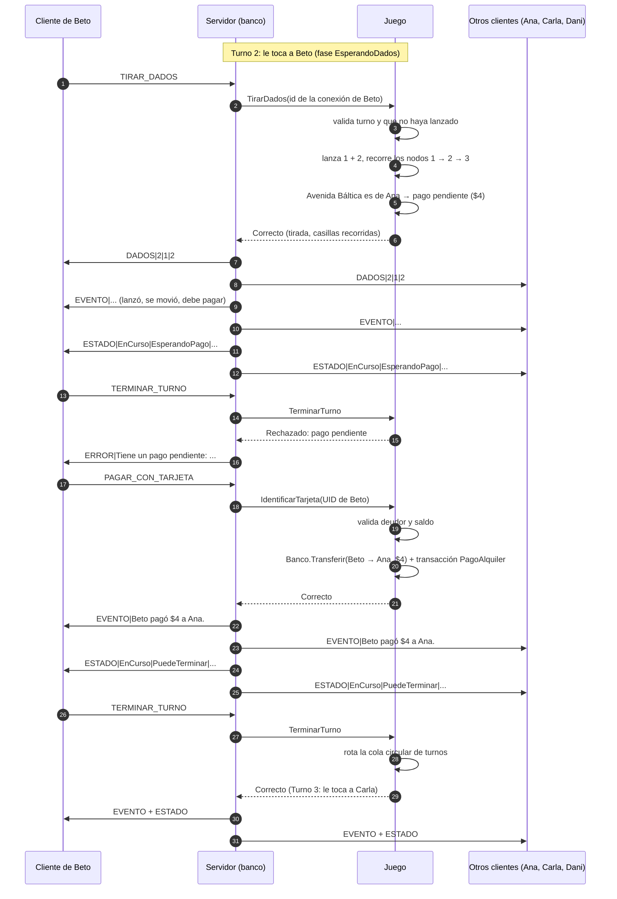

# Protocolo cliente-servidor

Comunicación por **sockets TCP** entre los clientes (jugadores) y el servidor (el **banco**, que corre en la computadora del organizador). Implementación: `Monopoly.Core.Red` (`Protocolo`, `Servidor`, `Cliente`, `SerializadorEstado`, `SerializadorTransacciones`).

## 1. Formato

- Puerto predeterminado: **5000** (configurable). El servidor escucha en todas las interfaces (`IPAddress.Any`).
- **Un mensaje por línea**, texto **UTF-8** sin BOM, terminado en `\n` (se acepta `\r\n` al leer).
- Formato: `COMANDO|campo1|campo2|...`. El comando va en mayúsculas (el servidor también acepta minúsculas).
- **Escape** dentro de los campos:

  | Carácter | Se envía como |
  |---|---|
  | `\` | `\\` |
  | `\|` (separador) | `\\|` |
  | salto de línea `\n` | `\n` (barra + letra n) |
  | retorno `\r` | `\r` (barra + letra r) |

  Ejemplo: el texto `Paga 50 | cumpleaños` viaja como `EVENTO|Paga 50 \| cumpleaños` (la barra invertida delante del separador indica que es parte del texto).
- Números en formato invariante (sin separador de miles). Booleanos como `1`/`0`. Un campo opcional vacío significa "ninguno".

## 2. Principios

- El cliente **solo envía solicitudes**. Nunca envía saldos, posiciones, dados, turnos, propiedades ni transacciones.
- El servidor **identifica al jugador por su conexión** (asociada en `CONECTAR`), no por un id enviado por el cliente.
- Toda solicitud la valida `Juego`. Si se rechaza, solo el solicitante recibe `ERROR|motivo`.
- Tras cada acción aceptada, el servidor **difunde a todos** los jugadores: los `EVENTO` nuevos, el `ESTADO` completo y, si la partida terminó, `FIN`. Tras `TIRAR_DADOS` además envía `DADOS` antes de los eventos.
- Las solicitudes se procesan de a una, así que todos reciben los mensajes en el mismo orden.

## 3. Solicitudes del cliente (cliente → servidor)

| Mensaje | Campos | Si se acepta | Errores posibles |
|---|---|---|---|
| `CONECTAR\|nombre` | nombre del jugador | `BIENVENIDA` al solicitante; `EVENTO` + `ESTADO` a todos | partida ya iniciada, máximo 4 jugadores, nombre vacío/repetido/reservado (`BANCO`), jugador ya conectado, conexión ya asociada |
| `INICIAR_PARTIDA` | — | `EVENTO` + `ESTADO` a todos | no es el organizador (primer jugador), menos de 2 jugadores, ya iniciada |
| `TIRAR_DADOS` | — | `DADOS` + `EVENTO` + `ESTADO` a todos | fuera de turno, ya lanzó en este turno, eliminado, partida no en curso |
| `COMPRAR_PROPIEDAD` | — | `EVENTO` + `ESTADO` a todos | fuera de turno, no lanzó, no es propiedad, ya tiene dueño, saldo insuficiente, sin compra pendiente |
| `NO_COMPRAR` | — | `EVENTO` + `ESTADO` a todos | fuera de turno, sin compra pendiente |
| `PAGAR_CON_TARJETA` | — | `EVENTO` + `ESTADO` a todos (y `FIN` si alguien queda como único jugador) | no hay pago pendiente, la tarjeta no es del deudor |
| `TERMINAR_TURNO` | — | `EVENTO` + `ESTADO` a todos (y `FIN` si se llegó al máximo de turnos) | fuera de turno, no lanzó, decisión de compra pendiente, pago pendiente |
| `CONSULTAR_ESTADO` | — | `ESTADO` solo al solicitante | — |
| `CONSULTAR_TRANSACCIONES\|filtro[\|valor]` | filtro: `TODAS`, `ANTIGUAS`, `RECIENTES`, `JUGADOR\|nombre`, `TIPO\|tipo` | `TRANSACCIONES` solo al solicitante | filtro desconocido, falta el valor, tipo desconocido |
| `EXPORTAR_TRANSACCIONES` | — | se escribe `partidas/partida_AAAA-MM-DD_HH-mm-ss.txt` **en la computadora del servidor**; `EVENTO` con la ruta + `ESTADO` a todos | error de escritura |
| `DESCONECTAR` | — | el servidor cierra la conexión; `EVENTO` + `ESTADO` a los demás | — |
| `RETIRAR_JUGADOR\|idJugador` | id del jugador a retirar | `EVENTO` + `ESTADO` a todos (y `FIN` si queda uno solo) | no es el organizador, el jugador está conectado, no existe, ya fue eliminado, partida no en curso |

Antes de `CONECTAR`, cualquier otra solicitud recibe `ERROR|Debe enviar CONECTAR|nombre antes de cualquier otra solicitud.` Un comando desconocido recibe `ERROR|Comando desconocido: X.`

`PAGAR_CON_TARJETA` es el **modo simulado** del lector RFID: el servidor usa el UID de la tarjeta del propio jugador (virtual, `VIRTUAL-{id}`, mientras no vincule una física). Con el lector real, el UID lo enviará el dispositivo.

Valores de `TIPO`: `CompraPropiedad`, `PagoAlquiler`, `PagoBanco`, `PagoEntreJugadores`, `GananciaEvento`, `PerdidaEvento`, `PremioInicio`.

## 4. Mensajes del servidor (servidor → cliente)

| Mensaje | Campos | Destino |
|---|---|---|
| `BIENVENIDA\|idJugador\|nombre` | id asignado (o recuperado al reconectarse) y nombre registrado | solicitante |
| `ERROR\|mensaje` | motivo legible del rechazo | solicitante |
| `ESTADO\|...` | estado completo (ver 4.1) | todos, o el solicitante en `CONSULTAR_ESTADO` |
| `DADOS\|idJugador\|dado1\|dado2` | quién lanzó y los dos valores (1 a 6) | todos |
| `EVENTO\|texto` | una línea del registro de la partida | todos |
| `TRANSACCIONES\|filtro\|N\|...` | resultado de una consulta (ver 4.2) | solicitante |
| `FIN\|ganador\|resumen` | nombre del ganador; patrimonio de cada jugador y ruta del TXT exportado | todos |
| `SERVIDOR_CERRADO\|motivo` | el servidor se va a cerrar (por ejemplo, `El organizador cerró la partida.`); inmediatamente después cierra la conexión | todos |

### 4.1 Campos de `ESTADO`

Después de `ESTADO` vienen 19 campos fijos:

| # | Campo | Ejemplo |
|---|---|---|
| 0 | estado de la partida (`EsperandoJugadores`, `EnCurso`, `Finalizada`) | `EnCurso` |
| 1 | fase del turno (`EsperandoDados`, `EsperandoDecisionCompra`, `EsperandoPago`, `PuedeTerminar`) | `EsperandoPago` |
| 2 | número de turno | `7` |
| 3 | máximo de turnos | `100` |
| 4 | id del jugador en turno (vacío si no hay partida en curso) | `2` |
| 5 | id del ganador (vacío si no terminó) | |
| 6 | casilla de la propiedad en venta (vacío si no hay) | |
| 7 | id del deudor con pago pendiente (vacío si no hay) | `2` |
| 8 | monto total del pago pendiente | `4` |
| 9 | descripción del pago pendiente | `Beto debe pagar $4 a Ana` |
| 10 | último dado 1 (vacío si nadie lanzó) | `1` |
| 11 | último dado 2 | `2` |
| 12 | id del jugador del último movimiento | `2` |
| 13 | casillas recorridas en ese movimiento, en orden (incluye movimientos por cartas; en un envío directo a la cárcel, solo la de llegada) | `1,2,3` |
| 14 | dueños de las propiedades, `casilla:idDueño` | `3:1,39:2` |
| 15 | cantidad de eventos del registro | `31` |
| 16 | cantidad de transacciones | `5` |
| 17 | cantidad de jugadores N | `4` |
| 18 | ids de los jugadores **desconectados** (sin conexión activa con el servidor) | `2` |

Luego **N bloques de 10 campos**, uno por jugador en orden de ingreso: `id`, `nombre`, `color` (`Rojo`, `Azul`, `Verde`, `Amarillo`), `saldo`, `posición` (0 a 39), `activo` (1/0), `turnos por perder`, `patrimonio`, `propiedades` (casillas separadas por coma), `tarjeta física` (1/0).

Ejemplo (2 jugadores; Beto debe alquiler a Ana):

```
ESTADO|EnCurso|EsperandoPago|2|100|2|||2|4|Beto debe pagar $4 a Ana|1|2|2|1,2,3|3:1|14|1|2||1|Ana|Rojo|1440|3|1|0|1500|3|0|2|Beto|Azul|1500|3|1|0|1500||0
```

### 4.2 Campos de `TRANSACCIONES`

`TRANSACCIONES|filtro|N` seguido de N bloques de 8 campos: `id`, `fecha y hora` (`yyyy-MM-ddTHH:mm:ss`), `turno`, `tipo`, `origen`, `destino`, `monto`, `descripción`. El origen o destino puede ser `BANCO`. Las transacciones vienen en el orden pedido.

```
CONSULTAR_TRANSACCIONES|JUGADOR|Ana
TRANSACCIONES|JUGADOR Ana|2|1|2026-09-29T15:30:00|1|CompraPropiedad|Ana|BANCO|60|Compra de Avenida Báltica|2|2026-09-29T15:31:10|2|PagoAlquiler|Beto|Ana|4|Avenida Báltica
```

## 5. Desconexiones y robustez

- Si un cliente se desconecta (con `DESCONECTAR` o por caída de la red), el servidor **no se cae**: cierra esa conexión, avisa a los demás con `EVENTO|X se desconectó...` (indicando si era su turno) y envía un `ESTADO` cuyo campo 18 lo marca como desconectado.
- Detección: al instante si la aplicación se cierra; en unos 20 s si se corta la red o se apaga la computadora (keepalive TCP: 10 s sin tráfico, 3 sondas cada 3 s), en ambos extremos.
- El jugador **sigue en la partida**: no se elimina, conserva saldo y propiedades, y no se salta su turno (la partida lo espera).
- Puede **reconectarse** enviando `CONECTAR` con el mismo nombre (sin distinguir mayúsculas) desde cualquier computadora: recupera su id con `BIENVENIDA`, los demás reciben `EVENTO|X se reconectó.` y todos un `ESTADO`.
- Si ese nombre ya tiene una conexión activa, se responde `ERROR|X ya está conectado desde otra conexión.`
- Si no vuelve, el organizador puede enviar `RETIRAR_JUGADOR|id`: el jugador queda eliminado sin pagar, sus propiedades se liberan y, si era su turno, pasa al siguiente. Solo lo puede pedir el organizador y solo sobre jugadores **desconectados** (errores: `Solo el organizador...`, `X está conectado...`, `No existe el jugador...`).
- Si el servidor se detiene de forma ordenada (el organizador cierra la aplicación), envía `SERVIDOR_CERRADO|motivo` a todos y cierra; el cliente informa ese motivo en su evento `Desconectado`. Si el servidor se cae sin avisar, el motivo es "Se perdió la conexión con el servidor...". El estado de la partida no se conserva entre reinicios.
- Solicitudes simultáneas: se procesan de a una (candado de procesamiento); solo prospera la del jugador en turno.
- Protección del servidor: cada envío tiene un tiempo máximo de 5 s (un cliente que deja de leer no bloquea a los demás: se le corta la conexión), las líneas recibidas tienen un máximo de 8192 caracteres y un error inesperado al procesar una solicitud responde `ERROR|Error interno...` sin cortar la conexión.
- El cliente espera como máximo 5 s para conectar (una IP inexistente no responde nunca).

## 6. Ejemplo de sesión

```
→ CONECTAR|Ana
← BIENVENIDA|1|Ana
← EVENTO|Ana se unió a la partida con la ficha Rojo.
← ESTADO|EsperandoJugadores|EsperandoDados|0|100|...|1|1|Ana|Rojo|1500|0|1|0|1500||0
   (Beto, Carla y Dani se conectan igual)
→ INICIAR_PARTIDA
← EVENTO|La partida comenzó con 4 jugadores (máximo 100 turnos).
← EVENTO|Turno 1: le toca a Ana.
← ESTADO|EnCurso|EsperandoDados|1|100|1|...
→ TIRAR_DADOS              (desde Beto)
← ERROR|No es el turno de Beto; le toca a Ana.
```

## 7. Turno completo



## 8. Herramienta de depuración

`src/Monopoly.ClienteConsola` (temporal) permite probar el protocolo sin interfaz gráfica:

```bash
dotnet build Monopoly.sln
dotnet run --project src/Monopoly.ClienteConsola --no-build -- servidor 5000
dotnet run --project src/Monopoly.ClienteConsola --no-build -- cliente 127.0.0.1 5000 Ana
```

En el cliente: `i` iniciar, `t` tirar, `c` comprar, `n` no comprar, `p` pagar con tarjeta, `f` terminar turno, `e` estado, `h [todas|antiguas|recientes|jugador X|tipo T]` historial, `x` exportar, `q` salir. Cualquier otra línea se envía tal cual (por ejemplo `CONSULTAR_TRANSACCIONES|TIPO|PagoAlquiler`).
