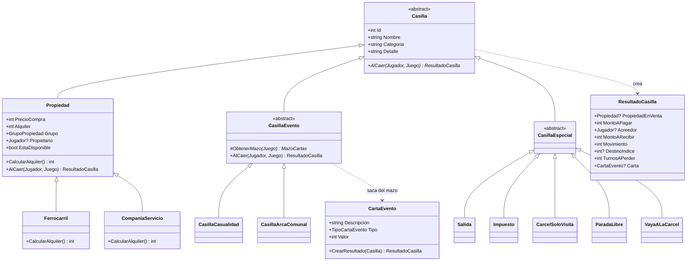
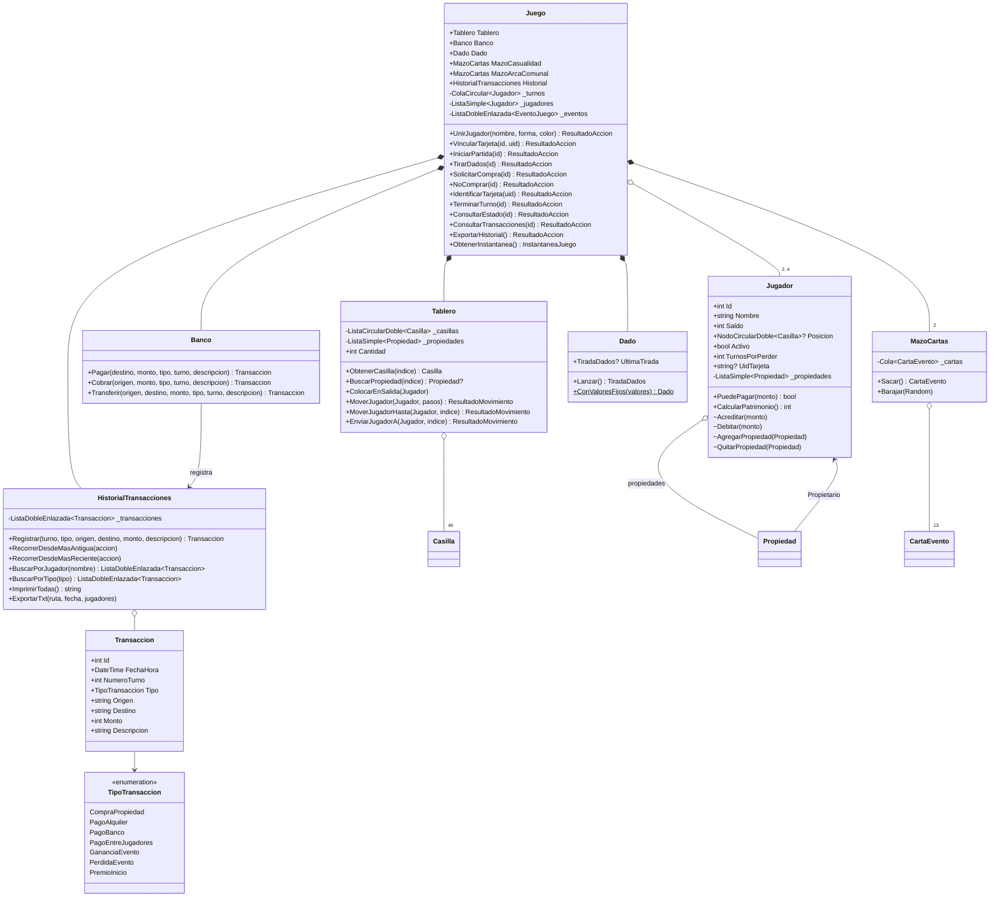
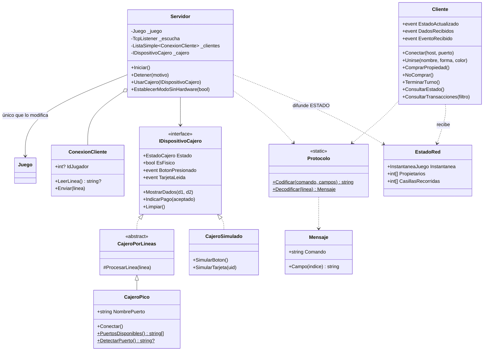
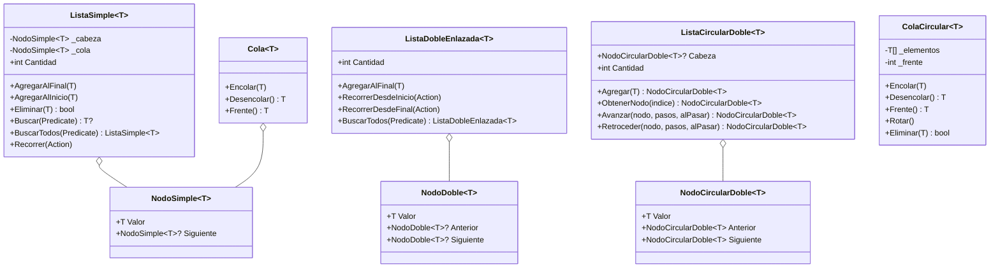

# Diagrama UML

Diagramas de clases del código actual (`src/Monopoly.Core`). GitHub los muestra directamente; en otros visores se pueden pegar en <https://mermaid.live>. Se muestran los miembros principales; los demás están documentados con comentarios XML en el código.

## 1. Casillas (herencia y polimorfismo)

La lógica no consulta el tipo de casilla: llama a `AlCaer`, que devuelve un `ResultadoCasilla` con los efectos como datos, y `Juego` los aplica de forma genérica.

## 2. Modelo y lógica del juego

## 3. Red y cajero electrónico

`Cliente` y `Servidor` se comunican por TCP con el protocolo de `docs/protocolo.md`; la `Pico W` se comunica con `CajeroPico` por USB serial con el protocolo de `hardware/README.md`. La interfaz (`Monopoly.App`) solo usa `Cliente`: nunca llama a `Juego`.

## 4. Estructuras de datos propias

Uso en el juego: `Tablero` → `ListaCircularDoble<Casilla>`; turnos → `ColaCircular<Jugador>`; mazos → `Cola<CartaEvento>`; historial → `ListaDobleEnlazada<Transaccion>`; propiedades del jugador y clientes del servidor → `ListaSimple<T>`. Detalle y complejidades en [`estructuras.md`](estructuras.md).
