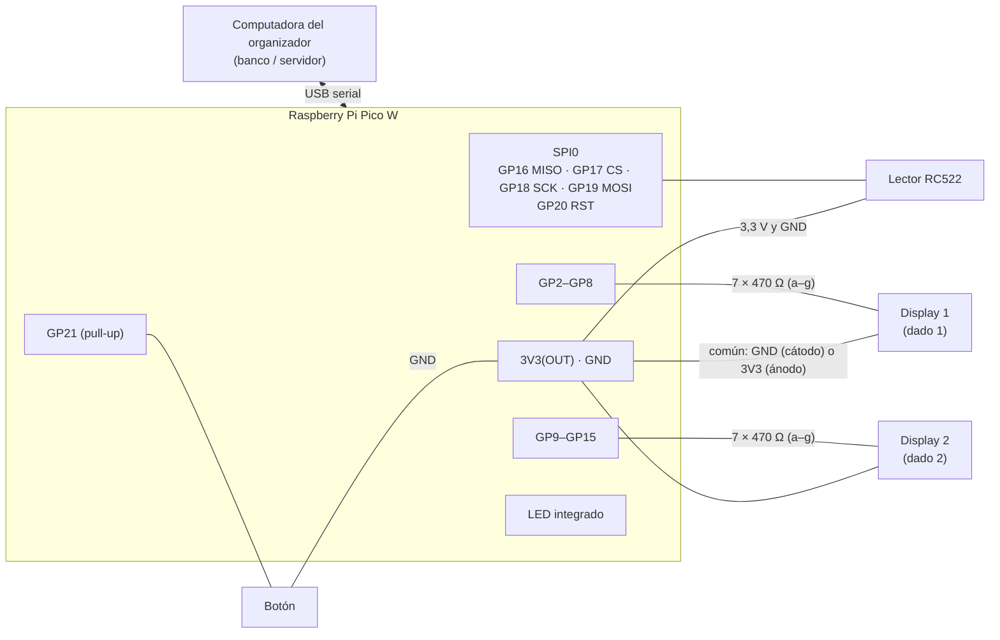

# Módulo electrónico (cajero): Raspberry Pi Pico W + MicroPython

El módulo hace de **dado electrónico** (2 displays de 7 segmentos y un botón) y de **lector de tarjetas RFID** (RC522). Se conecta por **USB** a la computadora del organizador, que aloja al banco. Los dados **no** se generan en la Pico: el botón pide la tirada al servidor, que la calcula (el estado oficial vive en el banco) y la envía de vuelta para mostrarla. La tarjeta solo identifica al jugador; el saldo está siempre en el servidor.

```
hardware/
├── README.md          este documento
└── pico/
    ├── main.py        programa principal (se ejecuta al encender la Pico)
    ├── mfrc522.py     driver mínimo del RC522 (lee el UID)
    └── prueba_uid.py  utilidad para ver y anotar el UID de cada tarjeta
```

## 1. Materiales

| Cantidad | Componente | Notas |
|---|---|---|
| 1 | Raspberry Pi Pico W | con pines soldados si se usa protoboard |
| 1 | Cable USB a micro-USB **de datos** | algunos cables solo cargan |
| 1 | Módulo lector RFID RC522 (13,56 MHz) | se alimenta a **3,3 V** |
| 2+ | Tarjetas o llaveros RFID MIFARE (13,56 MHz) | normalmente vienen con el RC522 |
| 2 | Displays de 7 segmentos de 1 dígito (0,56") | **rojos** (ver 3.2), ambos del mismo tipo: cátodo común o ánodo común |
| 14 | Resistencias de 470 Ω | una por segmento |
| 1 | Botón pulsador (4 patas) | |
| 1 | Protoboard grande (o 2 medianas) y cables dupont macho-macho | |

## 2. Conexiones

### 2.1 Lector RC522 (SPI0)

| RC522 | Pico W | Pin físico |
|---|---|---|
| SDA (CS) | GP17 | 22 |
| SCK | GP18 | 24 |
| MOSI | GP19 | 25 |
| MISO | GP16 | 21 |
| IRQ | sin conectar | — |
| GND | GND | 23 (o cualquier GND) |
| RST | GP20 | 26 |
| 3.3V | **3V3(OUT)** | 36 |

> **Nunca** alimente el RC522 desde VBUS (pin 40) ni VSYS (pin 39): son ~5 V y dañan el módulo.

### 2.2 Displays (conexión directa, sin multiplexar)

Cada segmento va a un GPIO **a través de su resistencia de 470 Ω**. El punto decimal (dp) no se usa.

| Segmento | Display 1 (dado 1) | Pin físico | Display 2 (dado 2) | Pin físico |
|---|---|---|---|---|
| a | GP2 | 4 | GP9 | 12 |
| b | GP3 | 5 | GP10 | 14 |
| c | GP4 | 6 | GP11 | 15 |
| d | GP5 | 7 | GP12 | 16 |
| e | GP6 | 9 | GP13 | 17 |
| f | GP7 | 10 | GP14 | 19 |
| g | GP8 | 11 | GP15 | 20 |
| común (cátodo común) | GND | 3, 8, 13 o 18 | GND | 3, 8, 13 o 18 |
| común (ánodo común) | 3V3(OUT) | 36 | 3V3(OUT) | 36 |

Los pines comunes van **directos** (sin resistencia). En `main.py`, ajuste la constante según sus displays:

```python
CATODO_COMUN = True    # cátodo común (común a GND)
CATODO_COMUN = False   # ánodo común (común a 3V3(OUT))
```

Distribución habitual de un display de 1 dígito de 10 pines (por ejemplo 5161AS = cátodo común, 5161BS = ánodo común), visto de frente con el punto decimal abajo a la derecha — **confírmela con la hoja de datos o con el multímetro en modo diodo**:

```
   10  9  8  7  6          10 = g   9 = f   8 = común   7 = a   6 = b
    ┌───────────┐
    │    ─a─    │           1 = e   2 = d   3 = común   4 = c   5 = dp
    │  f│   │b  │
    │    ─g─    │
    │  e│   │c  │
    │    ─d─  ● │
    └───────────┘
    1  2  3  4  5
```

### 2.3 Botón y LED

| Elemento | Conexión | Pin físico |
|---|---|---|
| Botón, una pata | GP21 | 27 |
| Botón, pata opuesta | GND | 28 |
| LED indicador | integrado en la Pico W (`Pin("LED")`) | — |

El botón usa la resistencia **pull-up interna** de GP21: suelto lee 1, presionado lee 0. En un pulsador de 4 patas, use dos patas en diagonal para no conectarlo "siempre cerrado".

### 2.4 Diagrama



## 3. Justificación de la resistencia de 470 Ω

1. **Corriente por segmento.** Los GPIO de la Pico W trabajan a 3,3 V. Un segmento rojo tiene una caída directa de ~1,9 V:
   I = (3,3 V − 1,9 V) / 470 Ω ≈ **3,0 mA** por segmento.
2. **Límite por pin.** Cada GPIO del RP2040 entrega por defecto hasta 4 mA (configurable a 2, 4, 8 o 12 mA). 3 mA queda dentro del valor por defecto, sin tocar la configuración.
3. **Límite total.** La hoja de datos del RP2040 recomienda no superar unos **50 mA en total** entre todos los GPIO. Sin multiplexar, el peor caso es "8 8": 14 segmentos encendidos × 3 mA ≈ **42 mA**, por debajo del límite. Con 330 Ω serían ~4,2 mA × 14 ≈ 59 mA, y con 220 Ω ~6,4 mA × 14 ≈ 89 mA: **470 Ω es el valor comercial más bajo que respeta el límite**, y a 3 mA un display rojo se ve bien en interiores.
4. **Cátodo o ánodo común.** Con cátodo común los GPIO entregan la corriente; con ánodo común la absorben y la entrega el regulador de 3V3(OUT) (hasta ~300 mA). En ambos casos cada pin maneja ~3 mA.
5. **Color.** Use displays **rojos** (o naranjas o amarillos). Los azules, blancos o verdes puros necesitan ~3 V y casi no encienden a 3,3 V con 470 Ω.

## 4. Instalar MicroPython en la Pico W

1. Descargue el firmware **específico de la Pico W** desde <https://micropython.org/download/RPI_PICO_W/>: el archivo `.uf2` de la versión estable más reciente, cuyo nombre empieza por `RPI_PICO_W-`. **No use el de la Pico sin W** (`RPI_PICO`): allí `Pin("LED")` no controla el LED de la Pico W.
2. Con la Pico **desconectada**, mantenga presionado el botón **BOOTSEL** y conecte el cable USB. Suelte el botón.
3. Aparece una unidad llamada **RPI-RP2**. Arrastre el `.uf2` a esa unidad.
4. La Pico se reinicia sola con MicroPython (la unidad desaparece; es normal).

## 5. Copiar los programas con Thonny

1. Instale Thonny desde <https://thonny.org>.
2. Conecte la Pico (sin BOOTSEL). En Thonny: **Herramientas → Opciones → Intérprete** → *MicroPython (Raspberry Pi Pico)*, y elija el puerto (o "detectar automáticamente"). En la consola (Shell) debe aparecer `>>>`.
3. Abra `hardware/pico/mfrc522.py` → **Archivo → Guardar como… → Raspberry Pi Pico** → nombre exacto `mfrc522.py`.
4. Abra `hardware/pico/main.py`. Revise `CATODO_COMUN` y guárdelo igual en la Pico como `main.py`.
5. (Opcional) Abra `prueba_uid.py` y ejecútelo con **Run (F5)** sin guardarlo: imprime el UID de cada tarjeta para anotarlo.

`main.py` se ejecuta automáticamente cada vez que la Pico recibe alimentación.

## 6. Probar desde la consola de Thonny

Con `main.py` abierto, pulse **Run (F5)**:

1. Los displays muestran **8 8** un instante (prueba de segmentos) y se apagan. En la consola aparece `LISTO`.
2. Escriba `DADOS:3,5` y Enter: los dos displays "giran" y quedan en **3** y **5**; el LED parpadea.
3. Escriba `LIMPIAR`: se apagan los displays.
4. Escriba `PING`: responde `PONG`.
5. Acerque una tarjeta: aparece `RFID:A1B2C3D4` (su UID) y el LED parpadea. Si deja la tarjeta apoyada, no se repite; retírela 2 s y vuelva a acercarla para que se lea de nuevo.
6. Presione el botón: aparece `BOTON` (una vez por pulsación).
7. Escriba algo inválido, por ejemplo `DADOS:9,1`: responde `ERROR:formato de DADOS invalido...` y el programa sigue funcionando.

**Antes de abrir el juego, cierre Thonny**: el puerto serie solo lo puede usar un programa a la vez.

## 7. Protocolo serie (Pico ↔ computadora)

Una línea de texto por mensaje. La velocidad (baudios) no importa en el USB de la Pico; use 115200. La Pico termina las líneas con `\r\n`.

| Dirección | Mensaje | Significado |
|---|---|---|
| Pico → PC | `LISTO` | el programa arrancó |
| Pico → PC | `BOTON` | se presionó el botón (pedir la tirada del jugador en turno) |
| Pico → PC | `RFID:<UID>` | tarjeta leída; UID en hexadecimal en mayúsculas, 8 o 14 caracteres |
| Pico → PC | `PONG` | respuesta a `PING` |
| Pico → PC | `ERROR:<detalle>` | problema del módulo (por ejemplo, RC522 desconectado); sigue funcionando |
| PC → Pico | `DADOS:d1,d2` | mostrar la tirada calculada por el servidor (valores de 1 a 6) |
| PC → Pico | `LIMPIAR` | apagar los displays |
| PC → Pico | `PING` | comprobar la conexión |

Notas para el programa de la computadora:
- `LISTO` se envía al arrancar, quizá antes de que la computadora abra el puerto: al conectarse, envíe `PING` y espere `PONG`.
- No envíe nunca el carácter Ctrl+C (0x03): MicroPython lo interpreta como "detener el programa".

## 8. Integración con el juego

La Pico se conecta a la computadora del **organizador**, que aloja al banco. Los demás jugadores no necesitan nada: ven en su pantalla todo lo que pasa en el cajero.

### Conectar

1. Cierre Thonny (el puerto solo lo puede usar un programa a la vez).
2. Conecte la Pico por USB y abra el juego → **Crear partida**.
3. En la barra **Cajero (Pico W)** (arriba en la sala de espera y en la ventana de juego del organizador):
   - elija el puerto COM y pulse **Conectar**, o
   - pulse **Detectar**: el juego prueba cada puerto enviando `PING` y se conecta al que responde `PONG`.
4. El indicador muestra el estado: `○ Sin cajero: modo simulado`, `● Pico W en COM5: …` (verde) o `● … desconectado: modo simulado` (naranja).

El puerto se abre a 115200 baudios, con `NewLine = "\n"` y **DTR y RTS activos** (sin DTR la Pico puede no enviar datos al PC). Un hilo aparte lee las líneas; las que no son del protocolo (mensajes de arranque de MicroPython, eco de la consola, UIDs mal formados) se ignoran. Cada 2 s se envía `PING`; si la Pico deja de responder durante ~7 s o se desconecta el cable, el juego **vuelve solo al modo simulado** sin cerrar la partida, y se puede pulsar **Conectar** de nuevo.

En Windows, la Pico con MicroPython aparece en el Administrador de dispositivos como "Dispositivo serie USB (COMx)" (USB VID `2E8A`, PID `0005`).

### Registrar las tarjetas (sala de espera)

1. Con la Pico conectada, el organizador elige un jugador en la lista y pulsa **Vincular tarjeta**.
2. Se acerca la tarjeta al lector: queda asociada a ese jugador (la lista muestra "· tarjeta RFID"). Un mismo UID no puede quedar asignado a dos jugadores.
3. **Cancelar vinculación** anula la espera. Los jugadores sin tarjeta física siguen usando su UID virtual (botón "Pagar con tarjeta").

### Durante la partida

| En el cajero | Qué hace el servidor |
|---|---|
| Se presiona el **botón** | Lo trata como `TIRAR_DADOS` del jugador en turno, con todas las validaciones (fuera de partida o dados ya lanzados → aviso en todas las pantallas). Genera la tirada, envía `DADOS:d1,d2` a la Pico y la difunde a todos los jugadores. |
| Un jugador tira desde su pantalla | La tirada también se envía a la Pico para mostrarla en los displays. |
| Se lee una tarjeta **con un pago pendiente** | `IdentificarTarjeta(uid)`: si es la del deudor, se ejecuta el pago, se registra la transacción y todos lo ven; si es de otro jugador o no está registrada, se rechaza con un aviso. |
| Se lee una tarjeta **sin pago pendiente** | Solo se informa de quién es y su saldo ("Cajero: Tarjeta de Beto: saldo $1,496."), sin modificar nada. |
| El módulo envía `ERROR:…` | Se muestra "Cajero: Error del módulo: …" en todas las pantallas. |

- La tarjeta **solo identifica** al jugador: el saldo vive siempre en el servidor.
- Con la Pico conectada, un jugador con **tarjeta física** debe pagar con el lector: su botón "Pagar con tarjeta" se deshabilita (y el servidor rechaza el pago simulado). Si la Pico se desconecta, vuelve a poder usar el botón.

En el código: `Monopoly.Core.Hardware` (`IDispositivoCajero`, `CajeroPico` sobre `SerialPort`, `CajeroSimulado`, `CajeroPorLineas`, `ProtocoloCajero`) y `Servidor.UsarCajero(...)`.

## 9. Solución de problemas

| Síntoma | Causa probable | Solución |
|---|---|---|
| No aparece la unidad RPI-RP2 | No se mantuvo BOOTSEL al conectar, o el cable es solo de carga | Repetir con BOOTSEL presionado; probar otro cable |
| Thonny no ve la Pico o dice "puerto ocupado" | Otro programa (el juego u otra ventana de Thonny) usa el puerto | Cerrar el otro programa; desconectar y conectar la Pico |
| `ValueError: invalid pin` o no encuentra "LED" | Se instaló el firmware de la Pico sin W | Instalar el `.uf2` de **RPI_PICO_W** |
| `ImportError: no module named 'mfrc522'` | Falta `mfrc522.py` en la Pico o tiene otro nombre | Guardarlo en la Pico con ese nombre exacto |
| Los displays muestran todo al revés (encendido lo apagado) | `CATODO_COMUN` no coincide con los displays | Cambiar la constante y volver a guardar `main.py` |
| Un display no enciende nada | Pin común mal conectado (GND vs 3V3) o display de otro tipo | Revisar el común y el tipo |
| Números "raros" (por ejemplo, el 2 se ve como otra cosa) | Segmentos cruzados | Comparar cada segmento con la tabla 2.2; con `DADOS:8,8` deben encender todos |
| Segmentos muy tenues | Displays azules, blancos o verdes (necesitan más de 3,3 V) | Usar displays rojos |
| `ERROR:RC522 no responde...` | Cable SPI suelto, RST sin conectar o sin 3,3 V | Revisar la tabla 2.1; `prueba_uid.py` muestra `VersionReg` (0x91/0x92 en chips originales; algunos clones dan 0x12, 0x88 o 0xB2; 0x00 o 0xFF indican un problema de cableado) |
| No lee las tarjetas | Tarjeta de otra frecuencia (125 kHz) o demasiado lejos | Usar tarjetas MIFARE de 13,56 MHz; apoyarlas sobre la antena |
| `BOTON` aparece solo o varias veces | El pulsador está conectado "siempre cerrado" (patas del mismo lado) | Usar dos patas en diagonal |
| El juego no recibe nada | Thonny sigue abierto, o `main.py` no se guardó en la Pico | Cerrar Thonny; comprobar que `main.py` está en la Pico y reconectarla |
| "No se pudo abrir COMx: está en uso por otro programa" | Thonny (u otra ventana del juego) tiene el puerto | Cerrar Thonny y pulsar Conectar |
| "COMx no respondió a PING" | La Pico está en la consola de MicroPython (`>>>`) sin ejecutar `main.py`, o ese puerto es otro dispositivo | Desconectar y conectar la Pico (ejecuta `main.py` al arrancar) o usar Detectar |
| "Detectar" tarda | Prueba también los puertos Bluetooth del equipo | Esperar, o elegir el puerto a mano |
