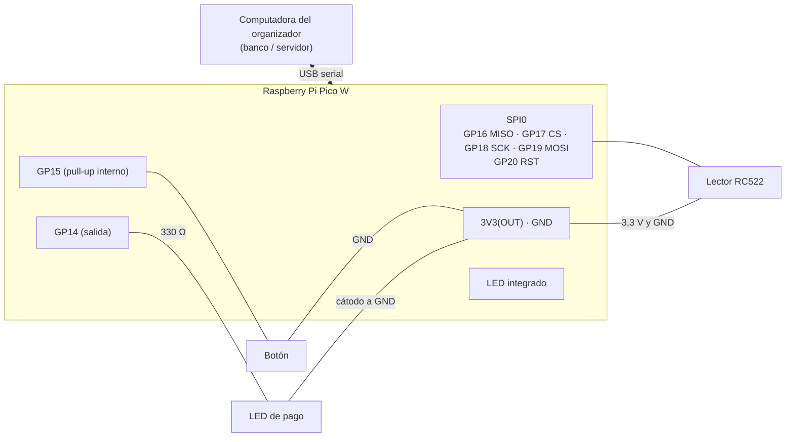

# Módulo electrónico (cajero): Raspberry Pi Pico W + MicroPython

El módulo tiene un **lector de tarjetas RFID** (RC522), un **botón** (pide la tirada de dados) y un **LED de pago** (confirma o rechaza un pago). Se conecta por **USB** a la computadora del organizador, que aloja al banco. Los dados **no** se generan en la Pico: el botón pide la tirada al servidor, que la calcula (el estado oficial vive en el banco). La tarjeta solo identifica al jugador; el saldo está siempre en el servidor.

```
hardware/
├── README.md            este documento
├── pico/                archivos para copiar a la Pico W
│   ├── main.py          programa principal (se ejecuta al encender la Pico)
│   ├── mfrc522.py       driver del RC522 (el original que funciona en la placa, sin cambios)
│   └── prueba_uid.py    utilidad para ver y anotar el UID de cada tarjeta (no se copia a la Pico)
└── pico_original/       copia de los archivos que había en la Pico antes de esta versión
```

## 1. Materiales

| Cantidad | Componente | Notas |
|---|---|---|
| 1 | Raspberry Pi Pico W | con pines soldados si se usa protoboard |
| 1 | Cable USB a micro-USB **de datos** | algunos cables solo cargan |
| 1 | Módulo lector RFID RC522 (13,56 MHz) | se alimenta a **3,3 V** |
| 2+ | Tarjetas o llaveros RFID MIFARE (13,56 MHz) | normalmente vienen con el RC522 |
| 1 | Botón pulsador | |
| 1 | LED (por ejemplo rojo o verde de 5 mm) | LED de pago |
| 1 | Resistencia de 330 Ω | en serie con el LED (ver 2.3) |
| — | Protoboard y cables dupont | |

## 2. Conexiones

### 2.1 Tabla de pines

| Elemento | Señal | Pico W | Pin físico |
|---|---|---|---|
| RC522 | SDA (CS) | GP17 | 22 |
| RC522 | SCK | GP18 | 24 |
| RC522 | MOSI | GP19 | 25 |
| RC522 | MISO | GP16 | 21 |
| RC522 | RST | GP20 | 26 |
| RC522 | IRQ | sin conectar | — |
| RC522 | 3.3V | **3V3(OUT)** | 36 |
| RC522 | GND | GND | 23 (o cualquier GND) |
| Botón | una pata | GP15 | 20 |
| Botón | otra pata | GND | 18 |
| LED de pago | ánodo (pata larga), a través de la resistencia | GP14 | 19 |
| LED de pago | cátodo (pata corta) | GND | 18 (o cualquier GND) |
| LED indicador | integrado en la placa | `Pin("LED")` | — |

> **Nunca** alimente el RC522 desde VBUS (pin 40) ni VSYS (pin 39): son ~5 V y dañan el módulo.

### 2.2 Botón

Entre **GP15** y **GND**, sin resistencia externa: el programa usa la resistencia **pull-up interna** (`Pin(15, Pin.IN, Pin.PULL_UP)`). Suelto lee 1 y presionado lee 0. El programa detecta el **flanco de bajada** con un antirrebote de 50 ms y envía `BOTON` **una sola vez por pulsación**, aunque se mantenga presionado. En un pulsador de 4 patas use dos patas en diagonal.

### 2.3 LED de pago

**GP14 → resistencia → ánodo del LED; cátodo del LED → GND** (activo en alto: un 1 lo enciende). Con 330 Ω, un LED rojo (≈ 2 V) consume (3,3 V − 2 V) / 330 Ω ≈ 4 mA, que es la corriente por defecto de un GPIO de la Pico. Con 220 Ω se ve más brillante (≈ 6 mA), todavía dentro de lo que admite el pin.

El LED **no** se enciende al leer la tarjeta: solo cuando el juego confirma el resultado del pago.

### 2.4 Diagrama



## 3. Protocolo serie (Pico ↔ computadora)

Una línea de texto por mensaje (la Pico termina sus líneas con `\r\n`). Por el serial **solo salen líneas del protocolo**: no hay banners ni mensajes decorativos.

| Dirección | Mensaje | Significado |
|---|---|---|
| Pico → PC | `LISTO` | el programa arrancó |
| Pico → PC | `BOTON` | se presionó el botón (una vez por pulsación) |
| Pico → PC | `RFID:<UID>` | tarjeta leída: **4 bytes** del UID en hexadecimal, mayúsculas, sin espacios (por ejemplo `RFID:A1B2C3D4`). `anticoll()` devuelve 5 bytes: el quinto es el checksum (BCC) y no forma parte del UID |
| Pico → PC | `PONG` | respuesta a `PING` |
| PC → Pico | `DADOS:d1,d2` | tirada calculada por el servidor; la Pico solo confirma la recepción con un destello del LED integrado |
| PC → Pico | `PAGO_OK` | pago aceptado: LED de pago encendido 2 segundos |
| PC → Pico | `PAGO_RECHAZADO` | pago rechazado: el LED de pago parpadea rápido 3 veces |
| PC → Pico | `LIMPIAR` | apaga el LED de pago |
| PC → Pico | `PING` | comprobar la conexión (responde `PONG`) |

Comportamiento:
- **Tarjetas:** la misma tarjeta no se repite mientras siga apoyada ni hasta 2 s después de retirarla (se controla con `time.ticks_ms()`, sin `sleep`); una tarjeta **distinta** se lee de inmediato.
- **Sin bloqueos:** el bucle revisa el botón cada ~10 ms, el lector cada ~100 ms y la entrada serial sin esperar (`sys.stdin` con `select.poll`). El encendido de 2 s y los parpadeos del LED también se controlan con `time.ticks_ms()`: el botón y el lector siguen funcionando mientras el LED está activo.
- **LED integrado:** destella al presionar el botón, al leer una tarjeta y al recibir `DADOS`.
- **Errores:** las excepciones dentro del bucle se capturan y el programa sigue funcionando. Los comandos desconocidos se ignoran sin responder. Para depurar en Thonny, ponga `DEPURAR = True` en `main.py`: los errores se imprimen como líneas que empiezan por `#` (el juego las ignora).

## 4. Instalar MicroPython en la Pico W

1. Descargue el firmware **específico de la Pico W** desde <https://micropython.org/download/RPI_PICO_W/>: el archivo `.uf2` de la versión estable más reciente, cuyo nombre empieza por `RPI_PICO_W-`. **No use el de la Pico sin W** (`RPI_PICO`): allí `Pin("LED")` no controla el LED de la Pico W.
2. Con la Pico **desconectada**, mantenga presionado el botón **BOOTSEL** y conecte el cable USB. Suelte el botón.
3. Aparece una unidad llamada **RPI-RP2**. Arrastre el `.uf2` a esa unidad.
4. La Pico se reinicia sola con MicroPython (la unidad desaparece; es normal).

## 5. Copiar los programas con Thonny

1. Instale Thonny desde <https://thonny.org>.
2. Conecte la Pico (sin BOOTSEL). En Thonny: **Herramientas → Opciones → Intérprete** → *MicroPython (Raspberry Pi Pico)* y elija el puerto (o "detectar automáticamente"). En la consola (Shell) debe aparecer `>>>`; si hay un programa corriendo, pulse **Stop**.
3. Abra `hardware/pico/mfrc522.py` → **Archivo → Guardar como… → Raspberry Pi Pico** → nombre exacto `mfrc522.py` (si pregunta, reemplace el existente).
4. Abra `hardware/pico/main.py` → **Archivo → Guardar como… → Raspberry Pi Pico** → `main.py`.
5. (Opcional) Para anotar los UID, abra `prueba_uid.py` y pulse **Run (F5)** sin guardarlo en la Pico.

`main.py` se ejecuta automáticamente cada vez que la Pico recibe alimentación.

## 6. Probar desde la consola de Thonny

Con `main.py` abierto, pulse **Run (F5)**. En la consola aparece `LISTO`. Luego:

| Acción | Resultado esperado |
|---|---|
| Presionar el botón (y mantenerlo) | Una sola línea `BOTON`; destello del LED integrado |
| Acercar una tarjeta | `RFID:A1B2C3D4` (su UID) y destello del LED integrado; dejándola apoyada no se repite |
| Acercar otra tarjeta | Su UID aparece de inmediato |
| Escribir `PING` + Enter | `PONG` |
| Escribir `DADOS:3,5` | Destello del LED integrado (no responde nada) |
| Escribir `PAGO_OK` | LED de GP14 encendido 2 segundos |
| Escribir `PAGO_RECHAZADO` | LED de GP14 parpadea rápido 3 veces |
| Escribir `LIMPIAR` | Apaga el LED de GP14 |

Mientras el LED de pago está encendido o parpadeando, el botón y el lector siguen respondiendo.

**Antes de abrir el juego, cierre Thonny**: el puerto serie solo lo puede usar un programa a la vez.

## 7. Integración con el juego

La Pico se conecta a la computadora del **organizador**. Los demás jugadores no necesitan nada: ven en su pantalla todo lo que pasa en el cajero.

### Conectar

1. Cierre Thonny.
2. Conecte la Pico por USB y abra el juego → **Crear partida**.
3. En la barra **Cajero (Pico W)** (arriba en la sala de espera y en la ventana de juego del organizador):
   - elija el puerto COM y pulse **Conectar**, o
   - pulse **Detectar**: el juego prueba cada puerto enviando `PING` y se conecta al que responde `PONG`.
4. El indicador muestra `○ Sin cajero: modo simulado`, `● Pico W en COM5: …` (verde) o `● … desconectado: modo simulado` (naranja).

El puerto se abre a 115200 baudios, con `NewLine = "\n"` y **DTR y RTS activos** (sin DTR la Pico puede no enviar datos al PC). Un hilo aparte lee las líneas; las que no son del protocolo (por ejemplo, los mensajes de arranque de MicroPython) se ignoran. Cada 2 s se envía `PING`; si la Pico deja de responder durante ~7 s o se desconecta el cable, el juego **vuelve solo al modo simulado** sin cerrar la partida, y se puede pulsar **Conectar** de nuevo.

En Windows, la Pico con MicroPython aparece como "Dispositivo serie USB (COMx)" (USB VID `2E8A`, PID `0005`).

### Registrar las tarjetas (sala de espera)

1. Con la Pico conectada, el organizador elige un jugador en la lista y pulsa **Vincular tarjeta**.
2. Se acerca la tarjeta al lector: queda asociada a ese jugador (la lista muestra "· tarjeta RFID"). Un mismo UID no puede quedar asignado a dos jugadores.
3. **Cancelar vinculación** anula la espera. Los jugadores sin tarjeta física siguen usando su UID virtual (botón "Pagar con tarjeta").

### Durante la partida

| En el cajero | Qué hace el servidor |
|---|---|
| Se presiona el **botón** | Lo trata como `TIRAR_DADOS` del jugador en turno, con todas las validaciones (fuera de partida o dados ya lanzados → aviso en todas las pantallas). Genera la tirada, envía `DADOS:d1,d2` a la Pico y la difunde a todos los jugadores. |
| Un jugador tira desde su pantalla | La tirada también se envía a la Pico (`DADOS:d1,d2`). |
| Se lee una tarjeta **con un pago pendiente** | `IdentificarTarjeta(uid)`: si es la del deudor, se ejecuta el pago, se registra la transacción, todos lo ven y se envía **`PAGO_OK`**; si es de otro jugador o no está registrada, se rechaza con un aviso y se envía **`PAGO_RECHAZADO`**. |
| Se lee una tarjeta **sin pago pendiente** | Solo se informa de quién es y su saldo ("Cajero: Tarjeta de Beto: saldo $1,496."), sin modificar nada ni tocar el LED de pago. |

- La tarjeta **solo identifica** al jugador: el saldo vive siempre en el servidor.
- Con la Pico conectada, un jugador con **tarjeta física** debe pagar con el lector: su botón "Pagar con tarjeta" se deshabilita (y el servidor rechaza el pago simulado). Si la Pico se desconecta, vuelve a poder usar el botón.

En el código: `Monopoly.Core.Hardware` (`IDispositivoCajero`, `CajeroPico` sobre `SerialPort`, `CajeroSimulado`, `CajeroPorLineas`, `ProtocoloCajero`) y `Servidor.UsarCajero(...)`.

## 8. Solución de problemas

| Síntoma | Causa probable | Solución |
|---|---|---|
| No aparece la unidad RPI-RP2 | No se mantuvo BOOTSEL al conectar, o el cable es solo de carga | Repetir con BOOTSEL presionado; probar otro cable |
| Thonny no ve la Pico o dice "puerto ocupado" | Otro programa (el juego u otra ventana de Thonny) usa el puerto | Cerrar el otro programa; desconectar y conectar la Pico |
| `ValueError: invalid pin` o no encuentra "LED" | Se instaló el firmware de la Pico sin W | Instalar el `.uf2` de **RPI_PICO_W** |
| `ImportError: no module named 'mfrc522'` | Falta `mfrc522.py` en la Pico o tiene otro nombre | Guardarlo en la Pico con ese nombre exacto |
| No lee las tarjetas | Cable SPI suelto, RST sin conectar, sin 3,3 V, o tarjeta de 125 kHz | Revisar la tabla 2.1; `prueba_uid.py` muestra `VersionReg` (0x91/0x92 en chips originales; algunos clones dan 0x12, 0x88 o 0xB2; 0x00 o 0xFF indican un problema de cableado); usar tarjetas MIFARE de 13,56 MHz |
| `BOTON` aparece solo o varias veces | El pulsador está conectado "siempre cerrado" (patas del mismo lado) | Usar dos patas en diagonal |
| El LED de pago no enciende con `PAGO_OK` | LED al revés o sin resistencia/GND | La pata larga (ánodo) va hacia GP14 a través de la resistencia; la corta, a GND |
| El juego no recibe nada | Thonny sigue abierto, o `main.py` no se guardó en la Pico | Cerrar Thonny; comprobar que `main.py` está en la Pico y reconectarla |
| "No se pudo abrir COMx: está en uso por otro programa" | Thonny (u otra ventana del juego) tiene el puerto | Cerrar Thonny y pulsar Conectar |
| "COMx no respondió a PING" | La Pico está en la consola de MicroPython (`>>>`) sin ejecutar `main.py`, o ese puerto es otro dispositivo | Desconectar y conectar la Pico (ejecuta `main.py` al arrancar) o usar Detectar |
| "Detectar" tarda | Prueba también los puertos Bluetooth del equipo | Esperar, o elegir el puerto a mano |
